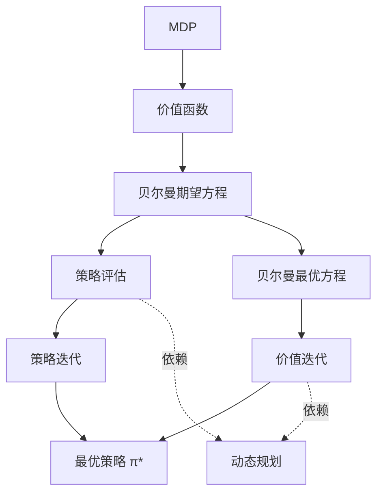

##### 数学期望
- 重复一个随机试验很多很多次（理论上无限次），每次试验都会产生随机变量的一个值。数学期望就是所有这些结果的平均值

# 强化学习

讨论的问题是智能体（agent）怎么在复杂、不确定的环境（environment）中最大化它能获得的奖励

## 决策序列

一系列动作的集合

# 强化学习智能体组成

1. 策略
    - 一个函数
    - $\pi(a | s)=p (a_t=a | s_t=s)$及当前状态下，接下来的动作的概率(随机策略)
2. 价值函数
    - 价值函数的值是对未来奖励的预测，我们用它来评估状态的好坏
    $$ 
    V_\pi(s) = \mathbb{E}_\pi 
    \left[
        \sum_{k=0}^{\infty} \gamma^{k}r_{t+k+1} | s_t=s 
    \right] 
    $$
    - $\gamma$是折扣因子(越趋近1奖励越高) , $r_{t}$是奖励函数
3. 模型
    模型决定了下一步的状态。下一步的状态取决于**当前的状态**以及**当前采取的动作**。它由***状态转移概率***和***奖励函数***两个部分组成。
    1. 状态转移概率即
$$ 
p_{ss^{'}}^a = p(s_{t+1}=s^{'}|s_{t}=s,a_{t}=a)
$$
        - 表示在状态 s 执行动作 a 后转移到状态 s′ 的概率
        - $s^{'}$表示下一个状态
    2. 奖励函数
        $$
            r(s,a) = \mathbb{E}
            \left[
                r_{t+1} | s_t =s , a_t = a
            \right]
        $$ 
        - 当前状态采取了某个动作，可以得到多大的奖励

4. 分类
    - [基于价值的智能体与基于策略的智能体](https://datawhalechina.github.io/easy-rl/#/chapter1/chapter1?id=_1%e5%9f%ba%e4%ba%8e%e4%bb%b7%e5%80%bc%e7%9a%84%e6%99%ba%e8%83%bd%e4%bd%93%e4%b8%8e%e5%9f%ba%e4%ba%8e%e7%ad%96%e7%95%a5%e7%9a%84%e6%99%ba%e8%83%bd%e4%bd%93)
    - [有模型强化学习智能体与免模型强化学习智能体](https://datawhalechina.github.io/easy-rl/#/chapter1/chapter1?id=_2%e6%9c%89%e6%a8%a1%e5%9e%8b%e5%bc%ba%e5%8c%96%e5%ad%a6%e4%b9%a0%e6%99%ba%e8%83%bd%e4%bd%93%e4%b8%8e%e5%85%8d%e6%a8%a1%e5%9e%8b%e5%bc%ba%e5%8c%96%e5%ad%a6%e4%b9%a0%e6%99%ba%e8%83%bd%e4%bd%93)


# [马尔科夫决策过程](https://datawhalechina.github.io/easy-rl/#/chapter2/chapter2)

---

#### **1. Markov Decision Process (MDP) - 马尔可夫决策过程**  
- **定义**：描述**智能体与环境交互**的数学框架，由五元组 $(S, A, P, r, γ)$ 定义：  
  - $S$：状态集合（如：机器人位置）  
  - $A$：动作集合（如：前进/后退）  
  - $P(s'|s,a)$：状态转移概率（在状态 $s$ 执行动作 $a$ 后到 $s'$ 的概率）  
  - $r(s,a,s')$：奖励函数（如：到达目标点奖励 +100）  
  - $γ$：折扣因子（0≤γ≤1，权衡当前与未来奖励）  
- **关键特性**：未来状态仅取决于**当前状态和动作**（马尔可夫性）  

---

#### **2. Value Function - 价值函数**  
- **作用**：量化策略的**长期收益**  
- **两类函数**：  
  - **State-Value Function ($V^π(s)$) - 状态价值函数**  
    > 表示从状态 $s$ 开始，遵循策略 $π$ 的**期望累积折扣奖励**  
    **公式**：$V^π(s) = E[ r_{t+1} \cdot γr_{t+2} \cdot γ²r_{t+3} \cdot \gamma^{3} r_{t+4} \cdot ... | S_t = s ]$  
	 $$
		V^{\pi}(s)=\mathbb{E}[ r_{t+1} ]+\ \mathbb{E}\ \gamma\ [ r_{t+2} \cdot \gamma^{1} r_{t+3} \cdot \gamma^{2} r_{t+4} ... | S_t = s ]$  
     $$
  - **Action-Value Function ($Q^π(s,a)$) - 动作价值函数**  
    > 表示在状态 $s$ 执行动作 $a$ 后，再遵循策略 $π$ 的**期望累积折扣奖励**  
    **公式**：$Q^π(s,a) = E[ r_t+1 \cdot γr_t+2 \cdot ... | S_t=s, A_t=a ]$  


---

#### **3. Bellman Expectation Equation - 贝尔曼期望方程**  
- **本质**：价值函数的**递归分解公式**（动态规划基础）  
- **状态价值方程**：  
$$
V^π(s) = \sum_{a \in A} π(a|s) *  \ [\ \sum_{s'}P(r|s,a)\ r(s,a) + γ *\sum_{s'}P(s'|s,a) V^π(s')\ ]
$$
  **解读**：
  - $Σ_a π(a|s)$：对策略 $π$ 下所有动作求和  
  - $Σ_s' P(s'|s,a)$：对所有可能转移到的状态求和  
  - $r + γV^π(s')$：即时奖励 + 后继状态的折扣价值  
- 动作价值函数：
$$
	q(s,a)=\sum_{s'} P(s'|s,a)r + γ *\sum_{s'} P(s'|s,a) V^π(s')
$$
---

#### **4. Policy Evaluation - 策略评估**  
- **目标**：计算给定策略 $π$ 的**状态价值函数 $V^π$**  
- **方法**：迭代求解贝尔曼期望方程  
  **算法步骤**：  
  初始化 $V(s) = 0$  
  repeat:  
    对每个状态 s:  
    $V_{new}(s) = Σ_a π(a|s) * Σ_s' P(s'|s,a) [ r(s,a) + γ * V_{old}(s') ]$
  直到 $V_{new} ≈ V_{old}$

---

#### **5. Dynamic Programming (DP) - 动态规划**  
- **在MDP中的作用**：通过**迭代法求解子问题**  
- **三大应用**：  
  - 策略评估（计算 $V^π$）  
  - 策略改进（生成更优策略）  
  - 策略迭代 & 价值迭代（求解最优策略）  

---

最优状态价值和贝尔曼最优方程
$$
V^π(s) = max\sum_{a \in A} π(a|s) *  \ [\ \sum_{s'}P(r|s,a)\ r(s,a) + γ *\sum_{s'}P(s'|s,a) V^π(s')\ ]
$$
不动点定理
$$
	||f(x_{1})-f(x_2)||\ =\ \gamma\ ||\ x_{1}-x_{2}\ ||
$$
#### **6. Policy Iteration - 策略迭代**  
- **流程**：  
  1. **策略评估**：计算当前策略 $π$ 的 $V^π$  
  2. **策略改进**：根据 $V^π$ 生成更优策略 $π'$：  
     $π'(s) = arg\,max_a \, Σ_s' P(s'|s,a) \ [ r(s,a) + γ * V^π(s')\ ]$  
  3. 重复上述步骤直至策略稳定  
- **输出**：最优策略 $π*$  

[策略迭代演示视频](https://www.bilibili.com/video/BV14f4y137Yh?spm_id_from=333.788.videopod.sections&vd_source=e10fcde680ff9830614522825e0c97b8)

---

#### **7. Value Iteration - 价值迭代**  
- **本质**：**跳过显式策略**，直接逼近最优价值函数 $V*$  
- **公式**（基于贝尔曼最优方程）：  
  $V_{k+1}(s) = max_a \ \sum_{s}' P(s'|s,a) \cdot [\ r(s,a) + \gamma * \ V_k(s')\ ]$  
- **步骤**
  初始化 $V(s) = 0$  
  repeat:  
    对每个状态 s:
    $V_{new}(s) = max_a \sum_s' P(s'|s,a) [\ r(s,a) + \gamma * V_{old}(s')\ ]$
  直到 $V_{new} ≈ V_{old}$
  提取最优策略：$π*(s) = argmax_a \sum_s' P(s'|s,a) [ r + \gamma * V*(s') ]$

[价值迭代演示视频](https://www.bilibili.com/video/BV18A411P7Lj?spm_id_from=333.788.videopod.sections&vd_source=e10fcde680ff9830614522825e0c97b8)

---

#### **8. MDP Control - 马尔可夫决策过程控制**  
- **目标**：寻找**最优策略 $π*$** 以最大化累积奖励  
- **两类方法**：  
  - **策略迭代**：显式维护策略（评估→改进循环）  
  - **价值迭代**：隐式优化策略（直接更新 $V*$ 后提取 $π*$）  

---
#### 9. 蒙特卡洛算法
- 稀疏奖励会影响agent的学习效率
- 通过**多次执行完整的 episode**（从初始状态到终止状态的全过程），收集每个状态（或状态 - 动作对）在 episode 中获得的实际回报，再通过平均这些回报来估计价值
$$
q(s,a) \approx \frac{\sum_{所有包含(s,a)的episode中对应的G_{t}}}{包含(s,a)的总次数}
$$

#### 10. MC exploreing starts
- 对已经生成的轨迹(trajectory),进行(s,a)状态价值访问可以得到新的episode
- 从每一个state-action对，开始生成无限多的episode找到最优策略
- 每次episode的开始，都随机初始化一个s和a，确保所有可能的(s,a)都有可能被选中
- 解决了MC basic探索不充分的问题

#### 11. MC $\epsilon$-greedy
- 平衡exploration和exploitation
$$
\pi(a|s_{t})= \left \{
\begin{aligned}
&1 - \epsilon + \frac{\epsilon}{\lvert A(s_t)\rvert } , &a = a^* \\
&\frac{1}{\lvert A(s_t)\rvert} \cdot \epsilon, &a \ne a^*
\end{aligned}
\right .
$$
 > $\lvert A(s_t) \rvert$ , 表示在状态$s_{t}$下，动作的总数

#### 12.随机近似
- 罗宾斯-门罗(Robbins - Monro) 算法，经典随机逼近算法 
	- $\theta_{n+1} = \theta_{n}-a_{n}\ \cdot Y_{n}$ 
	>  $\theta_{n}$ :   第n次迭代的估计值
	>  $a_{n}$ :   学习率
	>  $Y_{n}$ :   第n次观测值
- 随机梯度下降
$$
\begin{align*}
w_{k+1} &= \frac{1}{k} \sum_{j=1}^{k} \bar{x} = \bar{x},  (BGD) \\
w_{k+1} &= \frac{1}{k} \sum_{j=1}^{k} \bar{x}_j^{(m)},    (MBGD) \\
w_{k+1} &= \frac{1}{k} \sum_{j=1}^{k} x_j.                (SGD)
\end{align*}
$$

#### 13.TD


```
	
### 概念关系总结


1. **MDP 是问题基础** → **价值函数是评价标准**  
2. **贝尔曼方程是计算核心**：  
   - 贝尔曼**期望**方程 → 策略评估  
   - 贝尔曼**最优**方程 → 价值迭代  
3. **动态规划是方法载体**：  
   - 策略评估 → 策略迭代的组成部分  
   - 价值迭代 → 动态规划的直接应用  
4. **终极目标**：通过 **MDP 控制** 获得 **最优策略 $π*$**  

> **关键结论**：  
> - **策略迭代**：先评估策略价值 ($V^π$)，再改进策略（适合精确求解）  
> - **价值迭代**：直接优化价值函数 ($V*$)，最后提取策略（效率更高）  
> - 二者均依赖**动态规划**迭代求解贝尔曼方程


[参考资料](https://datawhalechina.github.io/easy-rl/#/)