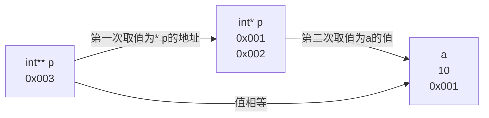

二级指针依次取值

> 先取得int*(*p)=int\*(0x002)=10,如果struct不同不知道能否取得

```C
#include<stdio.h>
#include <time.h>

int main(){
int a = 100 ;
&a ;
int* p = &a;
int* p2 = NULL ;
p2 = &a ;
int b = 200 ;
*p2 = b ;
int** p3 = &p2 ;
printf("%d",** p3);
}
```
> 结果为200
```C
#include<stdio.h>
#include <time.h>

int main(){
int a = 100 ;
&a ;
int* p = &a;
int* p2 = NULL ;
p2 = &a ;
char b = 200 ;
*p2 = b ;
int** p3 = &p2 ;
printf("%d",** p3);
}
```
> 结果为-56