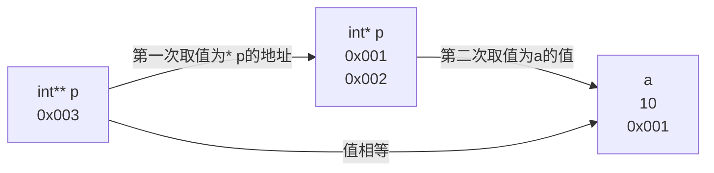
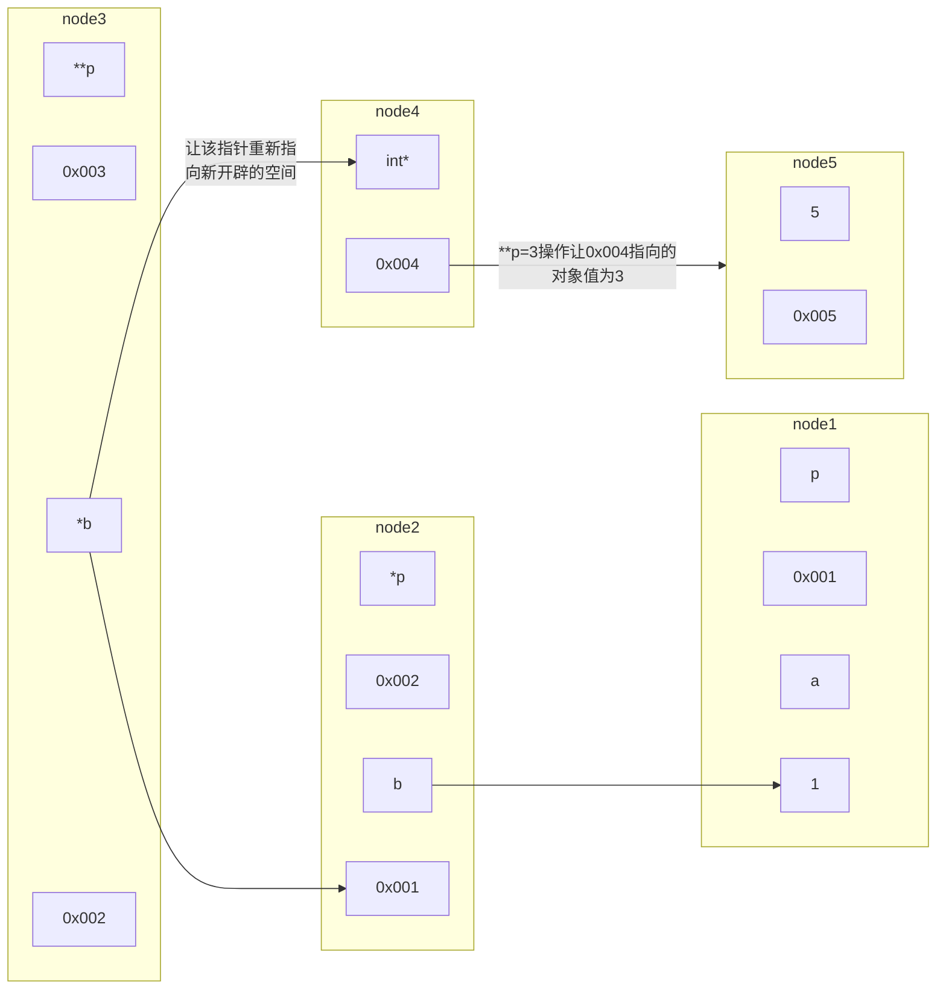

二级指针依次取值

> 先取得int*(*p)=int\*(0x002)=10,如果struct不同不知道能否取得

```C
#include<stdio.h>
#include <time.h>

int main(){
int a = 100 ;
&a ;
int* p = &a;
int* p2 = NULL ;
p2 = &a ;
int b = 200 ;
*p2 = b ;
int** p3 = &p2 ;
printf("%d",** p3);
}
```
> 结果为200
```C
#include<stdio.h>
#include <time.h>

int main(){
int a = 100 ;
&a ;
int* p = &a;
int* p2 = NULL ;
p2 = &a ;
char b = 200 ;
*p2 = b ;
int** p3 = &p2 ;
printf("%d",** p3);
}
```
> 结果为-56

```c
typedef struct Node
{
    int data;
    struct Node* next;
}Node;


void headInsert(Node* head_node,int data){
    Node* node=(Node*)malloc(sizeof(Node));
    node->next=head_node->next;             //将头节点的Next*赋给新建Node->next
    node->data=data;                        //
    head_node->next=node;                   //把头节点的Next*指向当前的新建的节点
    head_node->data++;                      //
}
```
Node结构体指针node指向结构体Node
```c
typedef struct BiTree{
    char data;
    struct BiTree* leftChild;
    struct BiTree* rightChild;
}BiTree ;

void createTree(BiTree* *T){   //*T本质上是一个地址
    char ch;
    scanf("%c",&ch);
    if (ch == '#') {
       *T=NULL; 
    }else {
        (*T)=(BiTree*)malloc(sizeof(BiTree));
        (*T)->data=ch;
        createTree(&((*T)->leftChild));      //  (*T)->leftChild访问当前地址，结构体中的leftChild.leftChild嵌在头节点里
        createTree(&((*T)->rightChild));
    }
}
```
BiTree结构体指针*root指针指向结构体BinaryTree




```C
#include <stdio.h>
#include <stdlib.h>

void f(int **p){
    **p=2;
    *p=(int*)malloc(sizeof(int));
    **p=3;
    printf("%d\n",**p);
}

int main(){
    int a =1;
    int *b =&a;
    f(&b);
    printf("%d %d",a,a);
}
```