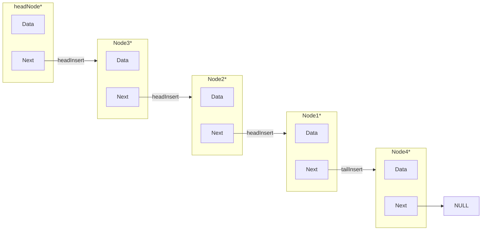

```mermaid
graph LR
        subgraph headNode*
        direction LR
            headData[Data]
            headPoint[Next]
        end
        subgraph Node1*
        direction LR
            newData1[Data]
            newNext1[Next]
        end
        subgraph Node2*
        direction LR
            newData2[Data] 
            newNext2[Next]
        end
        subgraph Node3*
        direction LR
            newData3[Data]
            newNext3[Next]
        end
        subgraph Node4*
        direction LR
            newData4[Data]
            newNext4[Next]
        end
        headPoint--headInsert-->Node3*
        newNext3--headInsert-->Node2*
        newNext2--headInsert-->Node1*
        newNext1--tailInsert-->Node4*
        newNext4-->NULL
```
