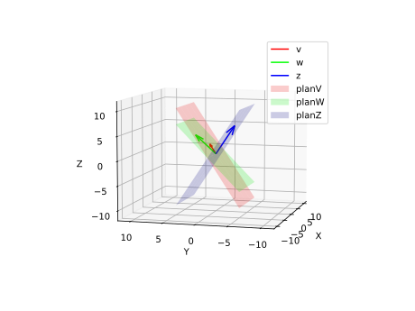
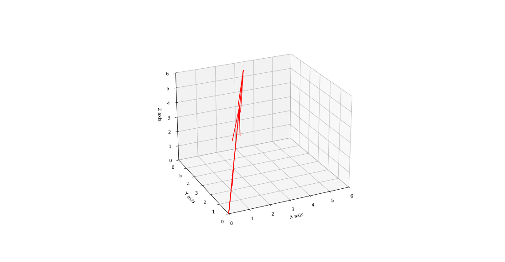

$$
\begin{equation*}
\begin{split}
    v=\left[\begin{array}{c}1 \\ 2 \end{array} \right],
    w=\left[\begin{array}{c}3 \\ 4 \end{array} \right]   \\
    3v=\left[\begin{array}{c}3 \\ 6\end{array} \right]   \\
    v+w=\left[\begin{array}{c}4 \\ 6\end{array} \right]  
\end{split}
 \end{equation*}
$$
$$
\begin{equation}
\begin{split}
    |\overrightarrow{v} \cdot \overrightarrow{w}| &\le ||\overrightarrow{v}|| \cdot ||\overrightarrow{w}|| \\
    向量\overrightarrow{v} \cdot \overrightarrow{w}构成的一个平行四边形面积 &\le ||\overrightarrow{v}|| \cdot ||\overrightarrow{w}||所构成的矩形面积 \\
    ||\overrightarrow{v} + \overrightarrow{w}|| &\le ||\overrightarrow{v}|| + ||\overrightarrow{w}|| \\
    三角形两边&之和大于第三边
\end{split}
\end{equation}
$$
# 向量空间(列空间)
## 线性无关
$$
\begin{equation}
\begin{split}
    v=\left[\begin{array}{c} 0 \\1\\2\end{array}\right],
    w=\left[\begin{array}{c} -1 \\3\\4\end{array}\right],
    z=\left[\begin{array}{c} 0 \\-3\\6\end{array}\right]
\end{split}
\end{equation}
$$
> 三个平面方便观察各向量的线性无关性

 <!--3dVectorsLinearInDependent.py-->
## 线性相关
$$
\begin{equation}
\begin{split}
    v=\left[\begin{array}{c} 1 \\1\\6\end{array}\right],
    w=\left[\begin{array}{c} 2 \\4\\0\end{array}\right],
    z=\left[\begin{array}{c} 3 \\5\\6\end{array}\right]
\end{split}
\end{equation}
$$
 <!--3dVectorsLinearInDependent.py-->

# 线性方程组

## 齐次线性方程组
> 齐次线性方程组个方程结果为零

$$
\begin{equation}
\begin{split}
    \left\{
        \begin{array}{c}
           x_1+2x_2+3x_3=0 \\
           2x_1+x_2+4x_3=0 \\
           x_1+3x_2+2x_3=0
        \end{array}
    \right.
\end{split} 
\end{equation}
$$

$$
\begin{equation*}
\begin{split}
    齐次线性方程组\left\{
        \begin{array}{lc}
            只有零解\\ \\\\ 
            存在非零解
        \end{array}
    \right.
\end{split} 
\end{equation*} \\
$$

> 例1(只有零解)

$$
\begin{equation}
\begin{split}
    &\left\{
        \begin{array}{r}
            x_1+2x_2+3x_3&=0\\
            4x_2+5x_3&=0 \\ 
            x_3&=0 
        \end{array}
    \right. 
\Rightarrow 
    \left[
    \begin{array}{c}
           1 & 2 & 3 \\  
           0 & 4 & 5 \\
           0 & 0 & 1
    \end{array}
    \right]
\end{split}
\end{equation}
$$
> 矩阵非零行数等于未知数个数，则该线性方程组只有零解

> 例2(存在非零解)

$$
\begin{equation}
\begin{split}
    \left\{
        \begin{array}{r}
            x_1+2x_2+3x_3&=0\\
            4x_2+5x_3&=0 \\ 
            0&=0 
        \end{array}
    \right. 
&\Rightarrow
    \left[
    \begin{array}{c}
           1 & 2 & 3 \\  
           0 & 4 & 5 \\
           0 & 0 & 0
    \end{array}
    \right] \\
&\Downarrow \\
     x=\left[
    \begin{array}{c}
        -\frac{1}{2}x_3 \\
        -\frac{5}{4}x_3 \\
        x_3(为何等于X_3?)
    \end{array}
    \right]   
&\Rightarrow 
     x=x_3\left[
    \begin{array}{c}
        -\frac{1}{2} \\
        -\frac{5}{4} \\ 
        1
    \end{array}
    \right]
\end{split}
\end{equation}
$$

> $X_3$可以取任意值

# 非齐次线性方程组(每个方程组不全为零解)

$$
\begin{equation}
\begin{split}
   \left\{ 
        \begin{array}{r}
            x_1+2x_2+3x_3&=5 \\
            x_1+3x_2+4x_3&=6 \\ 
            x_1+4x_2+5x_3&=7 \\ 
        \end{array}
    \right.
\end{split}
\end{equation}
$$

>增广矩阵无穷解的通解

$$
\begin{split}
&\left[
     \begin{array}{c:c}
     \begin{matrix}
        1&2&3 \\
        1&3&4 \\
        1&4&5 \\         
     \end{matrix} &
    \begin{matrix} 
       5 \\ 
       6 \\
       7
    \end{matrix}
    \end{array}
\right ]
\overleftrightarrow{增广矩阵(A|b)}
\left[
     \begin{array}{c:c}
     \begin{matrix}
        1&2&3 \\
        0&1&1 \\
        0&0&0 \\
     \end{matrix} &
    \begin{matrix} 
       5 \\ 
       1 \\
       0
    \end{matrix}
    \end{array}
\right]
\Rightarrow 
   \left\{ 
        \begin{array}{r}
            x_1+2x_2+3x_3&=5 \\
            x_2+x_3&=1  \\
            0&=0
        \end{array}
    \right. 
\Rightarrow 
   \left\{ 
        \begin{array}{r}
            x_1&=3-x_3 \\
            x_2&=1-x_3  \\
            x_3&=x_3
        \end{array}
    \right.  
x_1,x_2,x_3均是x_3的因变量 
\Rightarrow 
x=\left[
    \begin{array}{c}
    3-x_3 \\
    1-x_3 \\
    x_3 
    \end{array}
  \right] =
  \left[
    \begin{array}{c}
       3 \\
       1 \\
       0 
    \end{array}
  \right] +
  x_3\left[
    \begin{array}{c}
       -1 \\
       -1 \\
       1 
    \end{array}
  \right]  
\end{split} \\
r(A|b)=r(A)=2 < 3(未知数个数),方程组有无穷解\\
\left\{
    \begin{array}{r}
      x_1+2x_2+3x_3+x_4=3 \\ 
      x_1-4x_2-x_3-x_4=1 \\
      2x_1+x_2+4x_3+x_4=5 \\
      x_1-x_2+x_3=2
    \end{array}
\right .
\Rightarrow
\left[
    \begin{array}{c:c}
    \begin{matrix} 
       1 &2  &3  &1 \\
       1 &-4 &-1 &-1 \\
       2 &1  &4  &1 \\
       1 &-1 &1  &0
    \end{matrix} &
    \begin{matrix}
       3 \\
       1 \\
       5 \\
       2
    \end{matrix}
    \end{array} 
\right]
\Rightarrow
\left[
    \begin{array}{c:c}
    \begin{matrix}
       1 & 2 & 3 & 1 \\ 
       0 & 3 & 2 & 1 \\
       0 & 0 & 0 & 0 \\
       0 & 0 & 0 & 0
    \end{matrix} &
    \begin{matrix}
       3 \\
       1 \\
       0 \\
       0
    \end{matrix}
    \end{array}
\right]
\Rightarrow
\left\{
    \begin{array}{r}
     x_1+2x_2+3x_3+x_4=3 \\
     3x_2+2x_3+x_4=1
    \end{array}
\right. \\
general \quad equation(orthogonality) \\
x=k_1\left[
    \begin{array}{c}
        5 \\
        2 \\
        -3 \\
        0 
    \end{array}
\right] +
k_2\left[
    \begin{array}{c}
        1 \\
        1 \\
        0 \\
        3 
    \end{array}
\right] +
\left[
    \begin{array}{c}
        \frac{7}{3} \\
        \frac{1}{3} \\
        0 \\
        0 
    \end{array}
\right] \\(special \quad solution(the \quad variable \quad values \quad of \quad free \quad is\quad made\quad zero))
\\
$$

$$
r(A|b)=r(A)=3 = 3(未知数个数),方程组有唯一解
$$

$$
r(A|b)\ne r(A),方程组有无解
$$

# 矩阵乘法

>可视为向量的复合映射

$$y=f(u),u=g(x),f和g均是线性映射$$
$$
%矩阵A
A=\left[
    \begin{array}{c}
       1 & 2 \\
       3 & 4 
    \end{array}
\right] \cdot
\left[
    \begin{array}{c}
       x_1 \\
       x_2 
    \end{array}
\right] =
\left[
    \begin{array}{c}
       u_1 \\
       u_2 
    \end{array}
\right] \qquad (\quad g(x)\quad)
$$

$$
%矩阵B
B=\left[
    \begin{array}{c}
       5 & 6 \\
       7 & 8 
    \end{array}
\right] \cdot
\left[
    \begin{array}{c}
       u_1 \\
       u_2 
    \end{array}
\right] =
\left[
    \begin{array}{c}
        9 \\
       10 
    \end{array}
\right] \qquad (\quad f(u) \quad)
$$

$$
%矩阵AxB
B\cdot A=\left[
    \begin{array}{c}
       5 & 6 \\
       7 & 8 
    \end{array}
\right] \cdot
\left[
    \begin{array}{c}
       1 & 2 \\
       3 & 4 
    \end{array}
\right] \cdot
\left[
    \begin{array}{c}
       x_1 \\
       x_2 
    \end{array}
\right]=
\left[
    \begin{array}{c}
        9 \\
       10 
    \end{array}
\right] \qquad (\quad f\circ g\quad)
$$

# 逆矩阵
- 方阵才有逆矩阵
- 方阵的秩等于其行数(或列数),才可求逆矩阵
- 一个矩阵和其逆矩阵是可以交换的($A\cdot A^{-1}=A^{-1}\cdot A=E$)

假设有矩阵$A=\begin{bmatrix}
    1 & 3 & 5 \\
    2 & 4 & 6 \\
    1 & 4 & 9
    \end{bmatrix}$,那么则有$A\cdot A^{-1}=E$$
\begin{bmatrix}
    1 & 0 & 0\\
    0 & 1 & 0\\
    0 & 0 & 1
\end{bmatrix}$

#### 求逆矩阵
同步进行矩阵$A\xRightarrow{若干次初等变换} E,矩阵E\xRightarrow{若干次初等变换}A^{-1}$,即
$$
A|E=\left[
\begin{array}{ccc:ccc}
    1 & 3 & 5 & 1 & 0 & 0\\
    2 & 4 & 6 & 0 & 1 & 0\\
    1 & 4 & 9 & 0 & 0 & 1
\end{array}
\right] \xRightarrow{若干次初等变换}
E|A^{-1}\left[
\begin{array}{ccc:ccc}
    1 & 0 & 0 & -3 & \frac{7}{4} & \frac{1}{2}\\
    0 & 1 & 0 & 3 & -1 & -1\\
    0 & 0 & 1 & -1 & \frac{1}{4} & \frac{1}{2}
\end{array}
\right]
$$
>类似的,例如数值$a=3,a^{-1}=\frac{1}{3} \qquad 3|1 \xRightarrow{同乘\frac{1}{3}}1|\frac{1}{3} \quad a\cdot a^{-1}=1$ 

# 行列式

$$
\left|
\begin{array}{ccc}
   1 & 2 & 3 \\
   4 & 5 & 6 \\
   7 & 8 & 9 
\end{array}
\right |
$$