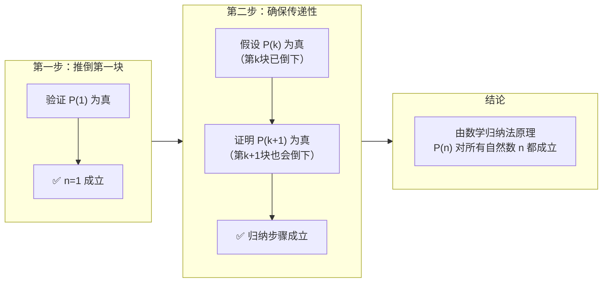

# 数学归纳法

数学归纳法是一种证明与自然数相关的命题的数学方法，它是数学中非常重要的证明技巧之一。

## 基本思想

数学归纳法的核心思想是：要证明一个命题对于所有自然数 $n$（或从某个自然数开始的所有自然数）都成立，我们只需要证明：

1. **基础情况**：当 $n$ 取第一个值（通常是 $n=1$ 或 $n=0$）时命题成立
2. **归纳步骤**：假设当 $n=k$ 时命题成立，能推出当 $n=k+1$ 时命题也成立
    
完成了这两个步骤，我们就可以得出结论：命题对所有自然数 $n$ 都成立。

## 数学表达

数学归纳法原理可以形式化地表述为：

设 $P(n)$ 是一个与自然数 $n$ 有关的命题，如果：

1. $P(1)$ 成立（基础步骤）
2. 对于任意自然数 $k$，如果 $P(k)$ 成立，则 $P(k+1)$ 也成立（归纳步骤）
    
那么，命题 $P(n)$ 对所有自然数 $n$ 都成立。

## 应用示例

**例子**：证明 $1 + 2 + 3 + \cdots + n = \frac{n(n+1)}{2}$ 对所有正整数 $n$ 成立。

**证明**：

1. **基础步骤**（$n=1$）：  
    左边 = 1，右边 = $\frac{1×(1+1)}{2} = 1$，等式成立。
2. **归纳步骤**：  
    假设当 $n=k$ 时公式成立，即：  
	$1+2+3+...+k = \frac{k(k+1)}{2}$
    需要证明当 $n=k+1$ 时公式也成立：  
    $1+2+3+...+k+(k+1) = \frac{k(k+1)}{2}+(k+1) = \frac{(k+1)(k+2)}{2}$
    这正是 $n=k+1$ 时的公式右边。
    因此，由数学归纳法原理，公式对所有正整数 $n$ 成立。
    

## 数学归纳法的变体

1. **第二数学归纳法（强归纳法）**：
    - 基础步骤：证明 $P(1)$ 成立
    - 归纳步骤：假设对于所有 $1 \leq m \leq k$，$P(m)$ 都成立，证明 $P(k+1)$ 也成立
        
2. **从其他起点开始的归纳法**：  
    归纳法可以从任何整数开始，不只是从 1 开始

### 一个数学例子：证明奇数和

**命题**：前 `n` 个奇数的和等于 `n²`。  
即：$1 + 3 + 5 + \cdots + (2n-1) = n^2$

**证明**：

1. **基础步骤 (n=1)**：
    
    - 左边：第一个奇数是 `1`。
        
    - 右边：$1^2 = 1$。
        
    - 左边=右边，✅ `P(1)` 成立。
        
2. **归纳步骤 (假设 P(k) 成立，证明 P(k+1) 成立)**：
    
    - **归纳假设**：假设当 `n=k` 时公式成立，即：  
        $1 + 3 + 5 + \cdots + (2k-1) = k^2$
        
    - **要证明的结论**：当 `n=k+1` 时，公式也成立，即：  
        $1 + 3 + 5 + \cdots + (2k-1) + (2(k+1)-1) = (k+1)^2$
        
    - **证明过程**：  
        我们从要证明的等式的左边开始：  
        `左边` = $[1 + 3 + 5 + \cdots + (2k-1)] + (2k+1)$  
        根据我们的归纳假设，括号里的部分正好等于 $k^2$，所以：  
        `左边` = $k^2 + (2k + 1)$  
        而这正好是：  
        `左边` = $(k+1)^2$  
        这恰好就是我们要证明的右边的形式。
        
    - **结论**：✅ `P(k) -> P(k+1)` 成立。
        
3. **最终结论**：  
    由数学归纳法，命题 $P(n)$ 对所有正整数 `n` 都成立

