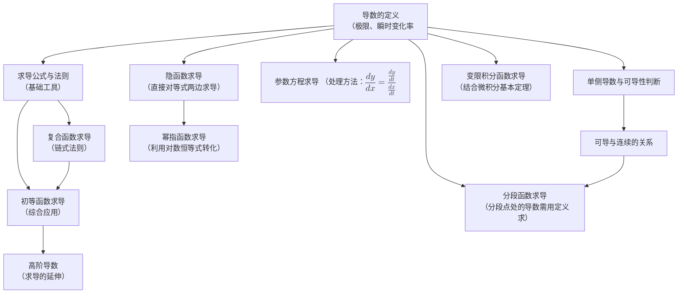

# 02. 导数的定义

- **核心思想**：导数源于求解**瞬时变化率**（如瞬时速度、曲线切线斜率）的问题。
    
- **数学定义**：函数 $f(x)$ 在点 $x_0$ 处的导数定义为极限：  
    $f'(x_0) = \lim_{\Delta x \to 0} \frac{f(x_0 + \Delta x) - f(x_0)}{\Delta x}$  
    也记作：$f'(x_0) = \lim_{x \to x_0} \frac{f(x) - f(x_0)}{x - x_0}$
- **几何意义**：函数图像在点 $(x_0, f(x_0))$ 处的**切线斜率**。
- **物理意义**：物体在 $t_0$ 时刻的**瞬时速度**。
    

# 03. 单侧导数和可导与连续的关系

- **单侧导数**：
    - **左导数**：$f'_-(x_0) = \lim_{\Delta x \to 0^-} \frac{f(x_0 + \Delta x) - f(x_0)}{\Delta x}$
        
    - **右导数**：$f'_+(x_0) = \lim_{\Delta x \to 0^+} \frac{f(x_0 + \Delta x) - f(x_0)}{\Delta x}$
        
- **可导的充要条件**：函数在某点可导 $\iff$ 该点的左导数与右导数都存在且相等。
- **可导与连续的关系**：
    - **可导一定连续**：如果函数在某点可导，那么它在该点必定连续。
    - **连续不一定可导**：例如，函数 $f(x) = |x|$ 在 $x=0$ 处连续但不可导（左导数 ≠ 右导数）。
    [[单侧导数和可导与连续的关系.pdf|示例]]

# 04. [[求导公式和求导法则]]

- **求导公式**：这是基础工具，必须熟记。
    - $(C)' = 0$ （C为常数）
    - $(x^n)' = n \cdot x^{n-1}$ （幂函数）
    - $(\sin x)' = \cos x$, 
    - $(\cos x)' = -\sin x$
    - $(e^x)' = e^x$, $(a^x)' = a^x \ln a$
    - $(\ln x)' = \frac{1}{x}$, $(\log_a x)' = \frac{1}{x \ln a}$
	- $\ (\sin x)' = \cos x$
	- $\ (\cos x)' = -\sin x$
	- $\ (\tan x)' = \sec^2 x = \frac{1}{\cos^2 x}$
	- $\ (\cot x)' = -\csc^2 x = -\frac{1}{\sin^2 x}$
	- $\ (\sec x)' = \sec x \tan x$
	- $\ (\csc x)' = -\csc x \cot x$
	- $$\ (\arcsin x)' = \frac{1}{\sqrt{1 - x^2}} \quad (x \in (-1, 1))$$
	- $\ (\arccos x)' = -\frac{1}{\sqrt{1 - x^2}} \quad (x \in (-1, 1))$
	- $\ (\arctan x)' = \frac{1}{1 + x^2} \quad (x \in \mathbb{R})$
	- $\ (\text{arccot } x)' = -\frac{1}{1 + x^2} \quad (x \in \mathbb{R})$
	- $\ (\text{arcsec } x)' = \frac{1}{|x|\sqrt{x^2 - 1}} \quad (|x| > 1)$
	- $\ (\text{arccsc } x)' = -\frac{1}{|x|\sqrt{x^2 - 1}} \quad (|x| > 1)$

- **求导法则**：
    - **加减法则**：$$[u(x) \pm v(x)]' = u'(x) \pm v'(x)$$
    - **乘法法则**：$$[u(x) \cdot v(x)]' = u'(x)v(x) + u(x)v'(x)，前导后不导 ，后导前不导$$
    - **除法法则**：$$[\frac{u(x)}{v(x)}]' = \frac{u'(x)v(x) - u(x)v'(x)}{[v(x)]^2} \quad (v(x) \neq 0)$$
        
# 05. 复合函数求导（链式法则）

- **核心内容**：这是求导中**最重要也是最容易出错**的部分。
    
- **链式法则**：如果 $y = f(u)$，而 $u = g(x)$，则 $y$ 关于 $x$ 的导数为：  
    $$\frac{dy}{dx} = \frac{dy}{du} \cdot \frac{du}{dx}$$ 或 $$y'(x) = f'(u) \cdot g'(x)$$
- **关键**：学会**分层**，从外到内逐层求导并相乘。
    

# 06. 初等函数求导

- **内容**：综合运用前面的**求导公式**、**法则**和**链式法则**，对由基本初等函数经过有限次四则运算和复合步骤构成的函数进行求导。
    
- **目标**：达到熟练、准确的计算水平。
    
# 07. 高阶导数

- **定义**：函数导数的导数，称为高阶导数。
- **记号**：二阶导数记作 $f''(x)$, $y''$ 或 $\frac{d^2y}{dx^2}$；n阶导数记作 $f^{(n)}(x)$, $y^{(n)}$ 或 $\frac{d^ny}{dx^n}$。
    
- **常见公式**：
    - $(e^{ax})^{(n)} = a^n e^{ax}$
    - $[\sin(ax)]^{(n)} = a^n \sin(ax + \frac{n\pi}{2})$
    - $[\cos(ax)]^{(n)} = a^n \cos(ax + \frac{n\pi}{2})$
    - $(x^m)^{(n)} = m(m-1)...(m-n+1)x^{m-n}$ （当 n ≤ m 时）
        
# 08. 分段函数求导

- **方法**：
    
    1. 对于**分段点之间**的部分，直接使用求导公式和法则。
        
    2. 对于**分段点**处，**必须使用导数的定义**来求左导数和右导数，并判断该点是否可导。
        

# 09. & 10. & 11. 隐函数求导

- **隐函数**：函数关系由方程 $F(x, y) = 0$ 确定，而非 $y = f(x)$ 的形式。
    
- **方法一（直接求导法）**：对方程 $F(x, y) = 0$ 两边同时关于 $x$ 求导。**切记：$y$ 是 $x$ 的函数**，所以遇到 $y$ 时要使用链式法则。然后解出 $y'$。
    
- **方法二（公式法）**：若 $F(x, y) = 0$，则 $\frac{dy}{dx} = -\frac{F'_x}{F'_y}$ （前提是 $F'_y \neq 0$）。此公式由直接法推导而来。
    
- **二阶导**：对一阶导数的结果两边再关于 $x$ 求一次导，然后将一阶导数 $y'$ 的表达式代入结果。
    

# 12. 幂指函数求导

- **幂指函数**：形如 $y = u(x)^{v(x)}$ （底数和指数都是函数）的函数。
    
- **方法**：使用**对数求导法**。
    
    1. 等式两边取自然对数：$\ln y = \ln [u(x)^{v(x)}] = v(x) \cdot \ln u(x)$
        
    2. 两边对 $x$ 求导：$\frac{1}{y} \cdot y' = v'(x) \cdot \ln u(x) + v(x) \cdot \frac{u'(x)}{u(x)}$
        
    3. 解出 $y'$：$y' = y \cdot [v'(x) \cdot \ln u(x) + v(x) \cdot \frac{u'(x)}{u(x)}]$
        
    4. 将 $y = u(x)^{v(x)}$ 代回上式。
        

#### 13. 变限积分函数求导

- **变限积分**：积分上限或下限是变量的积分，例如 $\int_{a}^{x} f(t) , dt$，它构成了一个关于 $x$ 的新函数。
    
- **求导公式（微积分基本定理）**：这是连接微分和积分的桥梁。
    
    - $\frac{d}{dx} \left[ \int_{a}^{x} f(t) , dt \right] = f(x)$
        
    - $\frac{d}{dx} \left[ \int_{x}^{b} f(t) , dt \right] = -f(x)$
        
    - $\frac{d}{dx} \left[ \int_{a}^{g(x)} f(t) , dt \right] = f(g(x)) \cdot g'(x)$ （结合了链式法则）

